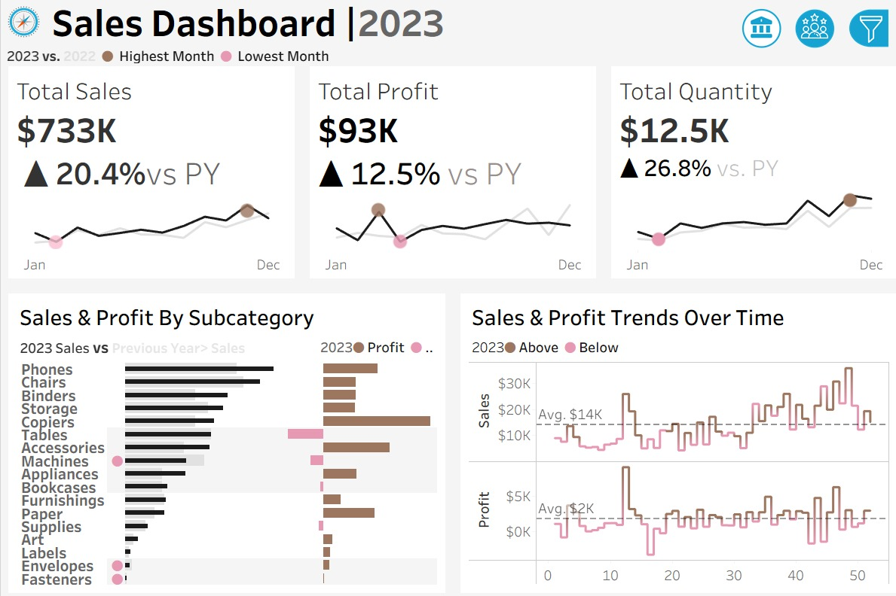
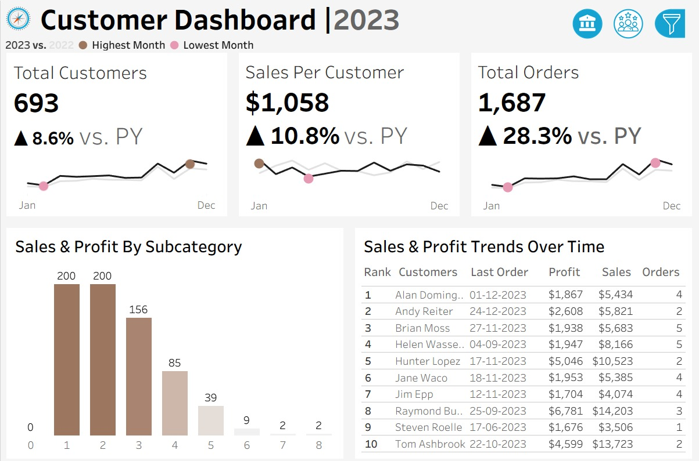

## Sales & Customer Dashboard – Tableau Project

## Project Overview
This project is an interactive Sales & Customer Analytics Dashboard built in Tableau to help businesses monitor performance, understand customer behavior, and identify sales trends through data-driven insights.
The dashboard transforms raw business data into meaningful visualizations that support strategic decision-making for sales growth, customer retention, and operational performance.
The project contains two main dashboards:
  Sales Dashboard
  Customer Dashboard

## KPIs Tracked
## The dashboard tracks several business-critical KPIs:

Total Sales
Total Profit
Total Orders
Quantity Sold
Total Customers
Sales per Customer
Weekly Performance Trends
Product Subcategory Performance

## Objectives of the Project
This project was created to:
Develop a professional business intelligence dashboard
Practice data storytelling and visualization techniques
Provide actionable business insights through analytics
Improve decision-making using interactive reporting
Showcase Tableau dashboard development skills

## Insights Generated
Best-performing product categories and subcategories
Customer segments generating the highest revenue
Weekly and yearly sales patterns
Profitability fluctuations across different periods
Top contributing customers

## Dashboard Interactivity
Interactive filters
Dynamic KPI cards
Drill-down visual analysis
Year selection parameter
Cross-dashboard navigation
Responsive visual storytelling

## Tableau Development
How to Use
Download the .twbx Tableau packaged workbook file.
Open the file using Tableau Desktop or Tableau Public.
Interact with filters and dashboards.
Explore customer and sales insights.

# Dashboard Preview
## Sales Dashboard

## Customer Dashboard

## About Me
Let's stay in touch! Feel free to connect with me on the following platforms:
- LinkedIn: https://www.linkedin.com/in/poojamadappa/
  
